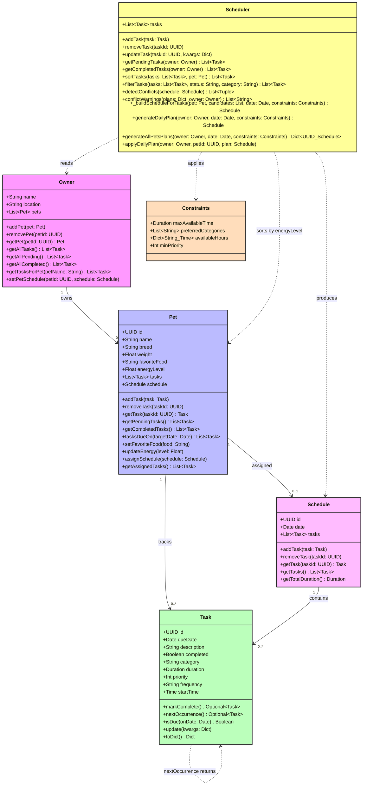

```mermaid
classDiagram
    class Owner {
        +String name
        +String location
        +List~Pet~ pets
        +addPet(pet: Pet)
        +removePet(petId: UUID)
        +getPet(petId: UUID) Pet
        +getAllTasks() List~Task~
        +getAllPending() List~Task~
        +getAllCompleted() List~Task~
        +getTasksForPet(petName: String) List~Task~
        +setPetSchedule(petId: UUID, schedule: Schedule)
    }

    class Pet {
        +UUID id
        +String name
        +String breed
        +Float weight
        +String favoriteFood
        +Float energyLevel
        +List~Task~ tasks
        +Schedule schedule
        +addTask(task: Task)
        +removeTask(taskId: UUID)
        +getTask(taskId: UUID) Task
        +getPendingTasks() List~Task~
        +getCompletedTasks() List~Task~
        +tasksDueOn(targetDate: Date) List~Task~
        +setFavoriteFood(food: String)
        +updateEnergy(level: Float)
        +assignSchedule(schedule: Schedule)
        +getAssignedTasks() List~Task~
    }

    class Task {
        +UUID id
        +Date dueDate
        +String description
        +Boolean completed
        +String category
        +Duration duration
        +Int priority
        +String frequency
        +Time startTime
        +markComplete() Optional~Task~
        +nextOccurrence() Optional~Task~
        +isDue(onDate: Date) Boolean
        +update(kwargs: Dict)
        +toDict() Dict
    }

    class Schedule {
        +UUID id
        +Date date
        +List~Task~ tasks
        +addTask(task: Task)
        +removeTask(taskId: UUID)
        +getTask(taskId: UUID) Task
        +getTasks() List~Task~
        +getTotalDuration() Duration
    }

    class Scheduler {
        +List~Task~ tasks
        +addTask(task: Task)
        +removeTask(taskId: UUID)
        +updateTask(taskId: UUID, kwargs: Dict)
        +getPendingTasks(owner: Owner) List~Task~
        +getCompletedTasks(owner: Owner) List~Task~
        +sortTasks(tasks: List~Task~, pet: Pet) List~Task~
        +filterTasks(tasks: List~Task~, status: String, category: String) List~Task~
        +detectConflicts(schedule: Schedule) List~Tuple~
        +conflictWarnings(plans: Dict, owner: Owner) List~String~
        +_buildScheduleForTasks(pet: Pet, candidates: List, date: Date, constraints: Constraints) Schedule
        +generateDailyPlan(owner: Owner, date: Date, constraints: Constraints) Schedule
        +generateAllPetsPlans(owner: Owner, date: Date, constraints: Constraints) Dict~UUID_Schedule~
        +applyDailyPlan(owner: Owner, petId: UUID, plan: Schedule)
    }

    class Constraints {
        +Duration maxAvailableTime
        +List~String~ preferredCategories
        +Dict~String_Time~ availableHours
        +Int minPriority
    }

    Owner "1" --> "0..*" Pet : owns
    Pet "1" --> "0..1" Schedule : assigned
    Pet "1" --> "0..*" Task : tracks
    Schedule "1" --> "0..*" Task : contains
    Scheduler ..> Owner : reads
    Scheduler ..> Pet : sorts by energyLevel
    Scheduler ..> Schedule : produces
    Scheduler ..> Constraints : applies
    Task ..> Task : nextOccurrence returns

    style Owner fill:#f9f,stroke:#333,stroke-width:2px
    style Pet fill:#bbf,stroke:#333,stroke-width:2px
    style Task fill:#bfb,stroke:#333,stroke-width:2px
    style Schedule fill:#fbf,stroke:#333,stroke-width:2px
    style Scheduler fill:#ff9,stroke:#333,stroke-width:2px
    style Constraints fill:#fdb,stroke:#333,stroke-width:2px
```

> **To export as PNG:** paste the code block above into [mermaid.live](https://mermaid.live), then use the download button to save as `uml_final.png`.
